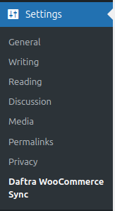
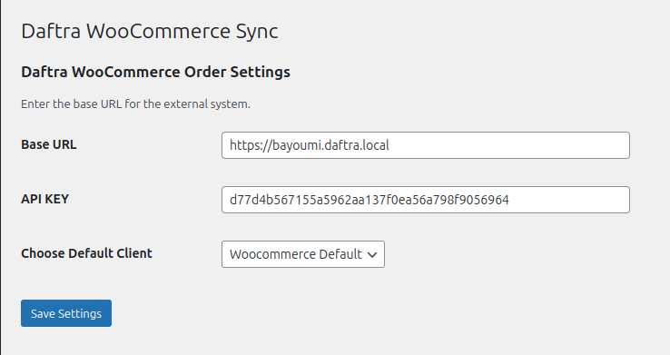
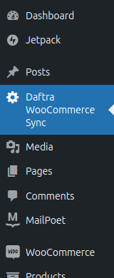
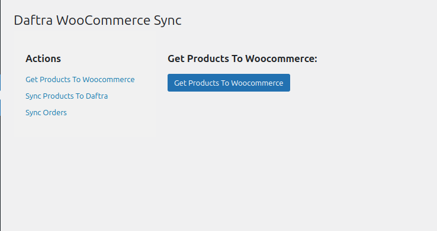

Daftra Commerce

Stable tag: 1.0

Tested up to: 6.6

License: GPLv2 or later

License URI: https://www.gnu.org/licenses/gpl-2.0.html


<h1>Daftra Commerce Plugin</h1>

---

<h2>Description:</h2>
this plugin is created to make <a href="www.daftra.com?agency_id=991">Daftra</a> users able to interact with their systems as it enables users to bring products, orders from and to woocommerce.

<h2>Authors:</h2>

development team of <a href="www.daftra.com?agency_id=991">Daftra</a> company.


<h2>Usage:</h2>
* <h3>After Installing the plugin from woocommerce marketplace you will find 2 new sections described below:</h3>
    <h3>1 - the section in settings dropdown</h3>

    

    when you click on this section in the settings you will see another view on the right hand side.
    

    this page containing the basic info for connecting <a href="www.daftra.com?agency_id=991">Daftra</a> and woocommerce.
    
    <h3>Base URL:</h3> this will be the subdomain you created when registered on <a href="www.daftra.com?agency_id=991">Daftra</a>.

    <h3>API KEY:</h3> this is the API KEY you can get from your <a href="www.daftra.com?agency_id=991">Daftra</a> system by going to Settings -> API -> API KEYS -> Generate API Key.
    
    After creation you can get the key appears in the list and put it here.

    <h3>Choose Default Client:</h3> this will have the default client to assign invoices to in case of the order doesn't contain a client.

    <h3> 2 - the section in sidebar which have</h3>
  
    
    
    when you click on this sidebar link you will see another view on the right hand side
    

    <h3>Get Products To Woocommerce:</h3> this will get all the products on your <a href="www.daftra.com?agency_id=991">Daftra</a> system to woocommerce.

    <h3>Sync Products To Daftra:</h3> this will get all your products on woocommerce down to <a href="www.daftra.com?agency_id=991">Daftra</a> system.

    <h3>Sync Orders:</h3> this will get all the invoices on your woocommerce down to <a href="www.daftra.com?agency_id=991">Daftra</a> system as invoices with payments.


  <h2>Changelog:</h2>
      ``Version 1.0.0``

  ```Initial release.```

<h2>Support Plan:</h2>
Email Support: Customers can reach out via support@daftra.com for issues and inquiries.
Response Time: We aim to respond to all support requests within 24 hours during business days.
Updates: The plugin will be updated regularly to maintain compatibility with new versions of WooCommerce and WordPress, and to fix any bugs or add requested features.

<h2>License:</h2>GPLv2 or later